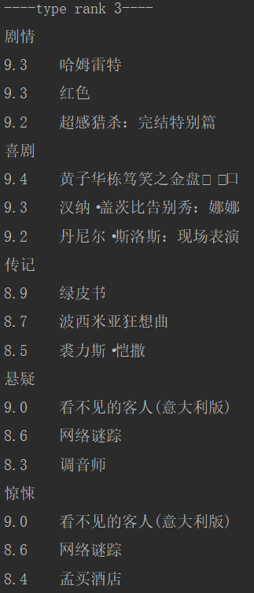
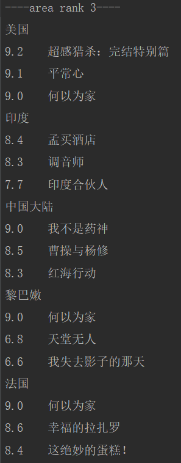
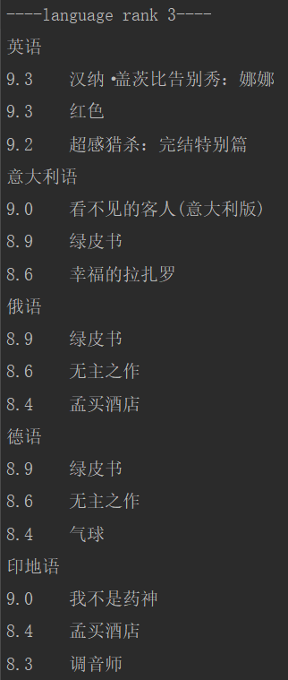
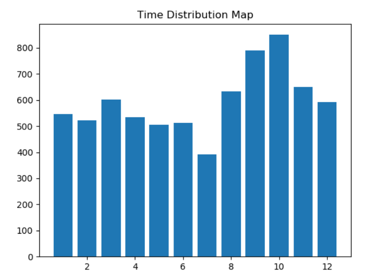

# **1.电影数据爬取**
数据来源于豆瓣，共爬取9976条电影数据

*- **使用方法***
```python
python crawler.py -y '年份'
python crawler.py -s '开始爬取的条数（20的倍数）'
```

*- **实现***（使用库requests、BeautifulSoup）

通过豆瓣api获取电影的基本数据，并保存
```python
url = 'https://movie.douban.com/j/new_search_subjects?sort=U&range=0,10&tags=%E7%94%B5%E5%BD%B1&start=' + start + '&year_range=' + year + ',' + year
request.get(url)
```
数据如下
```json
{
  "directors":["彼得·法雷里"],
  "rate":"8.9",
  "cover_x":2000,
  "star":"45",
  "title":"绿皮书",
  "url":"https://movie.douban.com/subject/27060077/",
  "casts":["维果·莫腾森","马赫沙拉·阿里","琳达·卡德里尼","塞巴斯蒂安·马尼斯科","迪米特·D·马里诺夫"],
  "cover":"https://img3.doubanio.com/view/photo/s_ratio_poster/public/p2549177902.webp",
  "id":"27060077",
  "cover_y":3167
  
}
```
通过获取到的url继续爬取电影的详细信息，查看网页源码发现电影基本的信息都在id='info'的div里面
```html
<div id="info">
        <span ><span class='pl'>导演</span>: <span class='attrs'><a href="/celebrity/1349765/" rel="v:directedBy">文牧野</a></span></span><br/>
        <span ><span class='pl'>编剧</span>: <span class='attrs'><a href="/celebrity/1375690/">韩家女</a> / <a href="/celebrity/1391650/">钟伟</a> / <a href="/celebrity/1349765/">文牧野</a></span></span><br/>
        <span class="actor"><span class='pl'>主演</span>: <span class='attrs'><a href="/celebrity/1274297/" rel="v:starring">徐峥</a> / <a href="/celebrity/1313837/" rel="v:starring">王传君</a> / <a href="/celebrity/1276085/" rel="v:starring">周一围</a> / <a href="/celebrity/1312976/" rel="v:starring">谭卓</a> / <a href="/celebrity/1322072/" rel="v:starring">章宇</a> / <a href="/celebrity/1275510/" rel="v:starring">杨新鸣</a> / <a href="/celebrity/1317520/" rel="v:starring">王佳佳</a> / <a href="/celebrity/1322085/" rel="v:starring">王砚辉</a> / <a href="/celebrity/1391651/" rel="v:starring">贾晨飞</a> / <a href="/celebrity/1274298/" rel="v:starring">龚蓓苾</a> / <a href="/celebrity/1274265/" rel="v:starring">宁浩</a> / <a href="/celebrity/1274530/" rel="v:starring">李乃文</a> / <a href="/celebrity/1310743/" rel="v:starring">岳小军</a> / <a href="/celebrity/1319163/" rel="v:starring">苇青</a> / <a href="/celebrity/1396851/" rel="v:starring">富冠铭</a> / <a href="/celebrity/1396800/" rel="v:starring">巴拉特·巴蒂</a> / <a href="/celebrity/1396458/" rel="v:starring">喜利图</a> / <a href="/celebrity/1396812/" rel="v:starring">张海艳</a> / <a href="/celebrity/1396885/" rel="v:starring">朱耕佑</a></span></span><br/>
        <span class="pl">类型:</span> <span property="v:genre">剧情</span> / <span property="v:genre">喜剧</span><br/>
        
        <span class="pl">制片国家/地区:</span> 中国大陆<br/>
        <span class="pl">语言:</span> 汉语普通话 / 英语 / 上海话 / 印地语<br/>
        <span class="pl">上映日期:</span> <span property="v:initialReleaseDate" content="2018-07-05(中国大陆)">2018-07-05(中国大陆)</span> / <span property="v:initialReleaseDate" content="2018-06-30(大规模点映)">2018-06-30(大规模点映)</span><br/>
        <span class="pl">片长:</span> <span property="v:runtime" content="117">117分钟</span><br/>
        <span class="pl">又名:</span> 中国药神 / 印度药神 / 印度药商 / 生命之路 / Dying to Survive / Drug Dealer<br/>
        <span class="pl">IMDb链接:</span> <a href="http://www.imdb.com/title/tt7362036" target="_blank" rel="nofollow">tt7362036</a><br>
</div>
```       
于是用BeautifulSoup获取'#info'里的文本，再切割字符串将需要的数据处理成键值对并添加进之前的电影基本数据中
```python
soup = BeautifulSoup(res.content, 'html.parser')
content = soup.select('#info')
info_list = content[0].text.strip().split('\n')
for i in info_list:
    item = i.split(': ')
    if item[0] == '制片国家/地区':
        movie['area'] = item[1]
    if item[0] == '类型':
        movie['type'] = item[1]
    if item[0] == '上映日期':
        movie['date'] = item[1]
    if item[0] == '语言':
        movie['language'] = item[1]
    if item[0] == '片长':
        movie['long'] = item[1]
```
加入评分人数
```python
votes = soup.find('span', {"property": "v:votes"})
movie['votes'] = votes.text if votes else "0"
```
最终数据
```json
{
  "directors": [
    "彼得·法雷里"
  ],
  "rate": "8.9",
  "cover_x": 2000,
  "star": "45",
  "title": "绿皮书",
  "url": "https://movie.douban.com/subject/27060077/",
  "casts": [
    "维果·莫腾森",
    "马赫沙拉·阿里",
    "琳达·卡德里尼",
    "塞巴斯蒂安·马尼斯科",
    "迪米特·D·马里诺夫"
  ],
  "cover": "https://img3.doubanio.com/view/photo/s_ratio_poster/public/p2549177902.jpg",
  "id": "27060077",
  "cover_y": 3167,
  "type": "剧情 / 喜剧 / 传记",
  "area": "美国",
  "language": "英语 / 意大利语 / 俄语 / 德语",
  "date": "2019-03-01(中国大陆) / 2018-09-11(多伦多电影节) / 2018-11-16(美国)",
  "long": "130分钟",
  "votes": "675198"
}
```

# **2.电影数据分析**

*- **使用方法***
```python
python show.py -r type/lauguage/area
python show.py -m month/type/area/lauguage
```

*- **实现***（使用库pandas、wordcloud、numpy、matplotlib）

使用pandas的DataFrame储存数据
```python
def movie_init():
    name = 201900001
    json_list = []
    while 1:
        try:
            with open("json/%s.json" % name, 'r', encoding='utf-8') as f:
                json_dir = json.load(f)
                json_list.append(json_dir)
            name += 1
        except IOError:
            break
    return pd.DataFrame(json_list)
```
按评分排序处理
```python
def rank(movie, name):
    di = {}
    for i in range(0, len(movie)):
        tr = {"title": movie.iloc[i]['title'], "rate": movie.iloc[i]['rate']}
        if tr['rate'] == '':
            continue
        try:
            li = movie.iloc[i][name].split(' / ')
        except AttributeError:
            continue
        for j in li:
            if j not in di.keys():
                di[j] = []
                di[j].append(tr)
            else:
                di[j].append(tr)
    print("----" + name + " rank 3----")
    for key, value in di.items():
        sort = sorted(value, key=lambda x: x['rate'], reverse=True)
        print(key)
        for s in range(3 if len(sort) >= 3 else len(sort)):
            if sort[s]['rate'] != '':
                print(sort[s]['rate'], "  ", sort[s]['title'])
    print("----------END----------")
```
类型前三      
    
地区前三     
   
语言前三  
   

生成上映时间分布图
```python
def paint(movie):
    num = [0] * 12
    for i in range(0, len(movie)):
        try:
            for n in re.findall(r"2018-(..)", movie.iloc[i]['date']):
                num[int(n) - 1] += 1
        except TypeError:
            continue
    plt.bar(range(1, 13), num)
    plt.title('Time Distribution Map')
    plt.show()
```
     

使用词云生成直观的数量对比图
```python
def show_image(file_name, width, height, max_font_size, old_image, new_image):
    txt = open(file_name, encoding='utf-8').read()
    ai_mask = np.array(Image.open("img/" + old_image))
    wc = WordCloud(background_color='white',
                   width=width,
                   height=height,
                   max_words=9000,
                   max_font_size=max_font_size,
                   collocations=False,
                   mask=ai_mask,
                   font_path="msyh.ttc")
    wc.generate_from_text(txt)
    img_colors = ImageColorGenerator(ai_mask)
    wc.recolor(color_func=img_colors)
    plt.imshow(wc)
    wc.to_file('img/' + new_image)
    plt.imshow(wc, interpolation='bilinear')
    plt.axis('off')
    plt.show()
```
评分人数     
    
地区前三     
   
语言前三  


